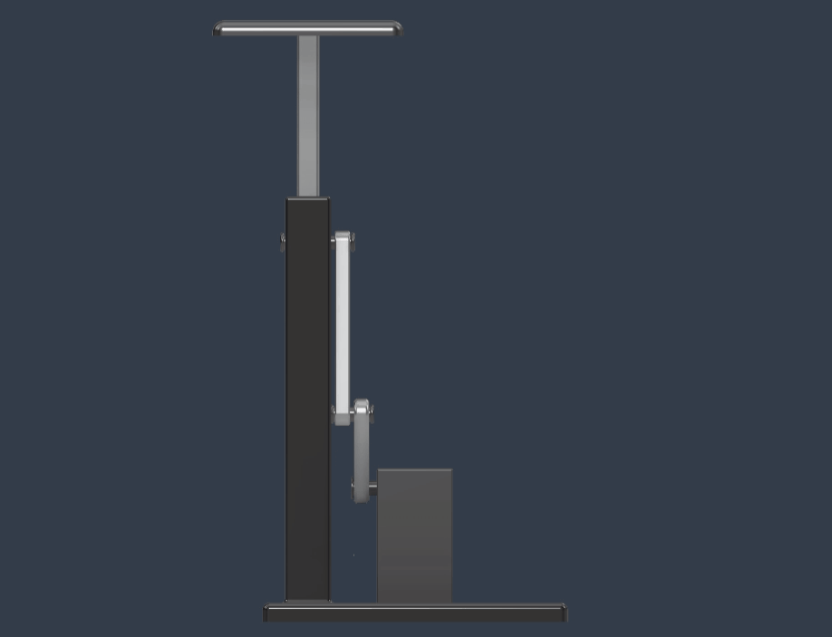
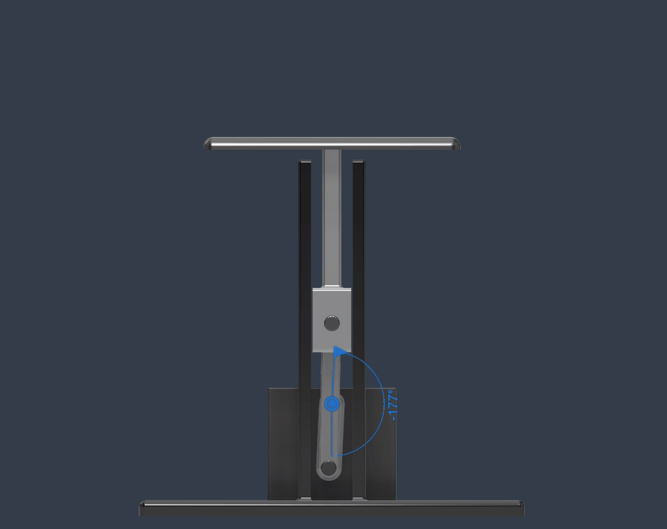
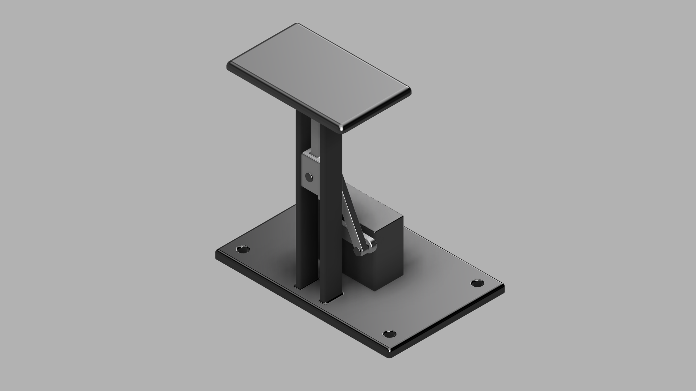
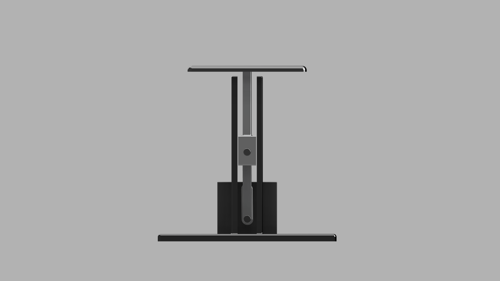
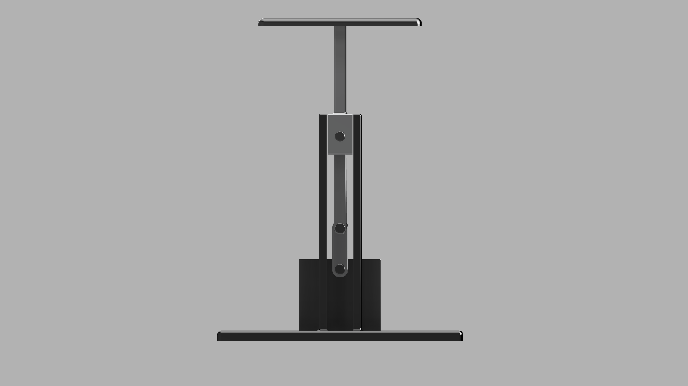
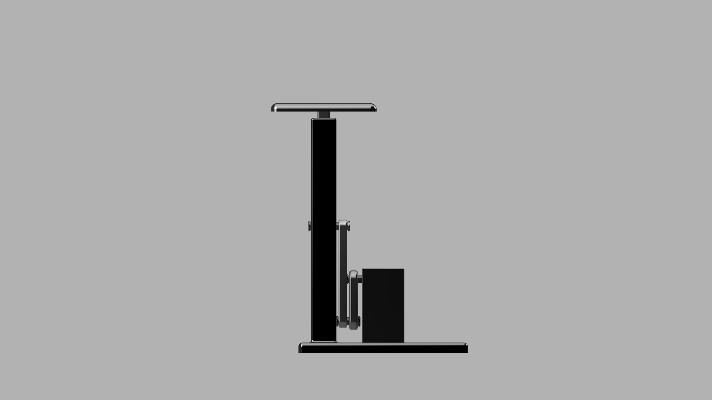
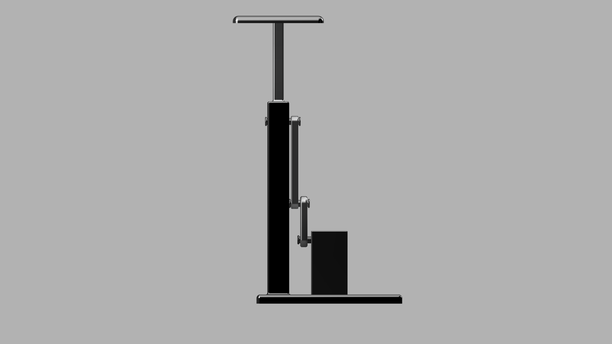

# Servo-Driven Chest Rise Mechanism Concept

This project is a CAD concept for a compact chest-rise mechanism intended for a medical simulation manikin. The mechanism converts rotary motion into guided vertical displacement using a crank arm, connecting rod, slider block, and support stem.

## Mechanism Motion

 

## Overview

The concept was designed to demonstrate a simple and readable actuation architecture for producing repeatable vertical chest movement. The assembly includes:

- Base plate with mounting holes
- Servo/motor placeholder block
- Crank arm
- Connecting rod
- Guided slider block
- Support stem
- Chest plate

## Render

## How It Works

The crank arm provides rotary input.  
That motion is transmitted through the connecting rod to a slider block constrained by guide walls.  
The slider block moves vertically and carries a support stem, which lifts and lowers the chest plate.

### Front view

### Side view

## Design Notes

This is a concept model intended to communicate mechanism layout and motion conversion rather than a production-ready design. The model was developed to show practical CAD work, linkage design, guided motion, and subsystem thinking relevant to robotic and electromechanical product development.

## Files

- Fusion CAD model: `cad/robotic_breathing_module.f3d`

## Purpose

This concept was developed to practice practical CAD, linkage design, and motion-conversion modeling in a form relevant to electromechanical product development.